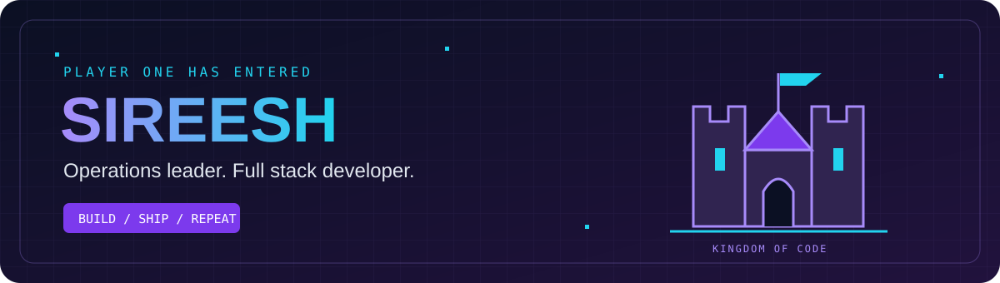

  

# 🏰 Welcome to My Kingdom of Code!

**Sireesh D · COO @ Pronexus Pvt Ltd · Full Stack Developer**

---

## 🎭 Choose Your Class

<table align="center">
<tr>
<td width="25%" align="center"><h3>🏗️ Architect</h3>
Explore the stack
</td>
<td width="25%" align="center"><h3>🚀 Builder</h3>
Discover the projects
</td>
<td width="25%" align="center"><h3>💼 Recruiter</h3>
Meet the person
</td>
<td width="25%" align="center"><h3>🤝 Collaborator</h3>
Start a conversation
</td>
</tr>
</table>

---

## 🏗️ The Architect

> **Class unlocked:** Full Stack Developer

I work across development, operations, and team leadership at **Pronexus Pvt Ltd**. My interests include practical automation, AI-powered tools, and developer workflows.

### 🛠️ Inventory

---

## 🚀 The Builder

> **Quest:** Turn ideas into useful products.

### 🧭 Composio Toolkit Atlas

An **AI Product Ops take-home** exploring a 100-app toolkit, with research, evidence, a runnable pipeline, and verification.

### 🌐 My Portfolio

My home on the web: professional experience, projects, and ways to connect. Built with **Next.js and React**.

---

## 💼 The Recruiter

> **Character:** Sireesh D

**Current role:** Chief Operating Officer at Pronexus Pvt Ltd 
**Focus:** Full stack development · Operations management · Team leadership 
**Interests:** Product execution · Automation · Open source

I enjoy connecting the technical work with the day-to-day work of running a team and moving a product forward.

---

## 🐍 Contribution Quest

<picture>
  <source media="(prefers-color-scheme: dark)" srcset="https://raw.githubusercontent.com/Sireeshreddy01/Sireeshreddy01/output/github-snake-dark.svg">
  <source media="(prefers-color-scheme: light)" srcset="https://raw.githubusercontent.com/Sireeshreddy01/Sireeshreddy01/output/github-snake.svg">
  
</picture>

---

## 🤝 The Collaborator

> **Co-op mode:** Let's build something useful.

Have a product idea, an automation challenge, or an open-source project? I'd love to hear about it.

**🏰 Build. Ship. Learn. Repeat.**

